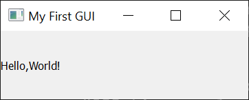

# Preparation

Download and install Qt Designer from <https://build-system.fman.io/qt-designer-download>. Note that this is an unofficial download. Officially, Qt Designer is released as part of Qt Creator, which can be downloaded from <https://www.qt.io/offline-installers>. The Qt Creator package is much larger. As the project is open source, a developer has extracted Qt Designer from Qt Creator for a smaller installation.

This tutorial also requires PyQt5, which is already installed in the `gus8066` conda environment. If you are working in a different environment, you can install PyQt5 with:

```sh
conda install pyqt=5
```

Note that as of Spring 2025, PyQt5 is the default version of PyQt, even though PyQt6 is available. However, there are breaking changes in PyQt6, so we are specifically requesting version 5.

# Creating GUIs with PyQT5 and Qt Designer

## Hello, World!

We begin with the traditional "Hello, World!" application, except that instead of displaying "Hello, World!" at the command line, we will display it in a windowed application.

Begin by creating a new file `hello_world.py`, and paste the following code into it:

```python
import sys

from PyQt5.QtWidgets import QApplication, QMainWindow, QLabel

# Subclass QMainWindow to customize your application's main window
class MainWindow(QMainWindow):
    def __init__(self):
        super().__init__()

        self.setWindowTitle("My First GUI")
        label_1 = QLabel("Hello,World!")

        # Set the central widget of the Window.
        self.setCentralWidget(label_1)

# You need one and only one QApplication instance
app = QApplication(sys.argv)

# Create and show the main window
window = MainWindow()
window.show()

# This starts the event loop. The GUI will start, and the application 
# will listen for events until the user exits.
app.exec()
```

Now, open a terminal and activate the `gus8066` environment. Then run the file you just created at the command line:

```sh
python hello_world.py
```

You should see the following (you may have to resize the window to see the title bar):



Or course, you usually don't want to distribute a GUI application that requires someone to have a Python installation and then launch the application at the command line. We will talk about packaging applications in a future workshop.

Notice that in the terminal, control has not returned to the prompt. That is, the terminal is not accepting input while the application is running (although the application can send messages to the terminal). Close the application window. You will see that the terminal is now accepting input again.

Let's go over what the code is doing.

At the top, we have some necessary imports. We always need to import QApplication. Then we import whatever other **widgets** we need.

```python
import sys

from PyQt5.QtWidgets import QApplication, QMainWindow, QLabel
```

The QMainWindow widget is a standard one that you will use in most of your applications. It can contain other widgets. We subclass it, which means we make a custom class (`MainWindow`) based on QMainWindow. We initialize it, and in the `__init__` method we add other widgets. In this case we add a QLabel widget. The QLabel widget is just a widget for text that is displayed to the user, but usually does not accept any user interaction. That is, it is not a textbox, button, etc. The QLabel constructor accepts a text string, which will appear in the label. (Interestingly, it can also accept a path to an image!) We also set the label as the "central widget" of the main window. Without this step, the label would not appear in the window!

```python
# Subclass QMainWindow to customize your application's main window
class MainWindow(QMainWindow):
    def __init__(self):
        super().__init__()

        self.setWindowTitle("My First GUI")
        label_1 = QLabel("Hello,World!")

        # Set the central widget of the Window.
        self.setCentralWidget(label_1)
```

The following code will be repeated over and over again in your GUI applications.

First, you instantiate QApplication. Each application needs one and only one QApplication instance.

```python
app = QApplication(sys.argv)
```

Second, you instantiate *and show* the main window. *Calling `.show()` is necessary.* Without it, the window is created, but invisible, and can't be interacted with by the user.

Oddly, *any* Qt widget can be a main application window. You may see tutorials online that skip subclassing QMainWindow, and just have a line here like `window = QLabel("Hello, World!")`.

```python
window = MainWindow()
window.show()
```

Finally, you launch the GUI with `.exec()`. (Remember that `app` is an instance of QApplication, so this is essentially executing, or launching, the actual GUI, after the previous code sets up what the GUI does.)

```python
app.exec()
```

This starts the **event loop**. The GUI will accept events, and then respond to them. There are no **event handlers** in this application, so it won't do anything, but if your application had a button, that would trigger an event. The event loop keeps responding to user and application events until you close the application.

## Intro to Qt Designer

The application we created doesn't do very much, and doesn't look very good. We may want to add more widgets. We may want to add more windows. We probably want the application to do something in response to user input. We also want to position and resize elements, add styling, etc. As the application gets more complex, we have to write more and more code.

This is where Qt Designer comes in. It is a graphical interface for building graphical interfaces. That is, instead of hand-coding a QLabel, we interactively add a label to a main window. We can reposition it, resize it, change the font size, color, and typeface. And of course we can add other widgets and lay them out in a logical way. Then when we are done we can convert the UI file to a Python module.

Let's start by creating a simple UI. In the process, we will also introduce **slots** and **signals**. This is how the widgets send and receive messages from each other.

The following is a brief synopsis of the instructions that will be demonstrated in class. Begin by launching Qt Designer.

1. Qt Designer open dialog, choose Main Window.
    * Explain difference between Main Window, Dialog, and Widget.
2. Show Property Editor. Show filtering. Change windowTitle.
3. Add Line Edit.
4. Add Label. Clear text.
5. Add Push Button. Change text to "Clear Text".
6. Create layout by right clicking on form background.
7. Open Signals/Slots editor.
8. Drag line edit to label, textChanged→setText.
9. Drag pushbutton to line edit, clicked→clear.
10. Save the file as `mainwindow1.ui`.

Qt Designer saves files with the extension `*.ui`. The UI file is an XML file. You can view it in a text editor. In order to use it to run our application, we will convert it to a Python file using `pyuic5`, a utility that was installed with PyQt5.

Converting the file is simple. In your terminal, issue the following command:

```sh
pyuic5 mainwindow1.ui -o mainwindow1.py
```

If you open `mainwindow1.py`, you will see a lot of Python code. It looks similar to what we saw in our "Hello, World!" application, but with more widgets and many more properties. The most important thing to not is the big warning at the top:

**WARNING: Any manual changes made to this file will be lost when pyuic5 is run again.  Do not edit this file unless you know what you are doing.**

In order to use this file, we will create a main module, much like we did for "Hello, World!".

> **NOTE:** There is another way to do this. The UI file can be imported directly using `PyQt5.uic.loadUi("file.ui")`. However, using `pyuic5` to convert the UI file to a Python file appears to be more common. Be aware of the difference if you see code online that uses `loadUi()`. This is a design choice.

Create a new Python file in the same directory as `mainwindow1.py`, and call it `main1.py`. Paste in the following code:

```python
import sys
from PyQt5 import QtWidgets, uic

from mainwindow1 import Ui_MainWindow


class MainWindow(QtWidgets.QMainWindow, Ui_MainWindow):
    def __init__(self, *args, obj=None, **kwargs):
        super().__init__(*args, **kwargs)
        self.setupUi(self)


app = QtWidgets.QApplication(sys.argv)

window = MainWindow()
window.show()
app.exec()
```

This is pretty similar to the "Hello, World!" application, except that the `MainWindow` class makes use of something called **multiple inheritance**. It inherits from `QMainWindow` like before, but it *also* inherits from `Ui_MainWindow`, which is imported from `mainwindow1.py`, the module we just created. Why is the class name `Ui_MainWindow`? Because the `QMainWindow` object in Qt Designer is named `MainWindow` (you can confirm this in Qt Designer) and `pyuic5` prepended the object name with `Ui_` when it created the class. If you created a Dialog Box or Widget you would instead end up with a class named `Ui_Dialog` or `Ui_Widget`. `*args` and `**kwargs` are included for more complex applications, but in this case the `QMainWindow` is not being created with any additional arguments.

The only other thing that is needed is `self.setupUi(self)`, which actually creates the GUI based on the information stored in `mainwindow.py`, which istelf is a record of all of our work in Qt Designer.

We can run this application as we did previously. At the command line:

```sh
python main1.py
```

Type into the line edit and see what happens. Hit the Clear Text button and see what happens. These actions are the result of the signals and slots that we set up in Qt Designer.


## A GUI Application with More Complex Signals and Slots

The following is a brief synopsis of the instructions that will be demonstrated in class. Begin by launching or creating a new project in Qt Designer.


1. Qt Designer open dialog, choose Main Window.
2. Add 3 labels stacked vertically. Change name of `label` to `label_1`. Set text to:
    * "Input file:"
    * "Target CRS (EPSG):"
    * "Output file:"
3. Add 3 line edits next to the labels. Change name of `lineEdit` to `lineEdit_1`.
4. Add Tool Buttons next to input file and output file line edits. Change name of `toolButton` to `toolButton1`.
5. Add a Push Button at the bottom. Set text to "Reproject".
6. Select `lineEdit_1` and `toolButton_1`. Layout horizontally. Do the same for `lineEdit_2` and `toolButton_2`.
7. Create layout by right clicking on form background. Choose Lay Out in a Form Layout.
8. Save the file as `mainwindow2.ui`.

```sh
pyuic5 mainwindow2.ui -o mainwindow2.py
```

Create a file `main2.py` and paste in the following code:

```python
import sys
from PyQt5 import QtWidgets

from mainwindow2 import Ui_MainWindow
from reproject import reproject

class MainWindow(QtWidgets.QMainWindow, Ui_MainWindow):
    def __init__(self, *args, obj=None, **kwargs):
        super().__init__(*args, **kwargs)
        self.setupUi(self)

        # Set filenames
        self.toolButton_1.clicked.connect(self.open_file)
        self.toolButton_2.clicked.connect(self.save_file)

        # Signal for Reproject
        self.pushButton.clicked.connect(self.reproject_file)

    def open_file(self):
        fn = QtWidgets.QFileDialog.getOpenFileName(self, "Open spatial layer", ".", "Shapefiles (*.shp)")[0]
        self.lineEdit_1.setText(fn)
    
    def save_file(self):
        fn = QtWidgets.QFileDialog.getSaveFileName(self, "Save spatial layer", ".", "Shapefiles (*.shp)")[0]
        self.lineEdit_3.setText(fn)

    def reproject_file(self):
        crs = int(self.lineEdit_2.text())
        reproject(self.lineEdit_1.text(), crs, self.lineEdit_3.text())

app = QtWidgets.QApplication(sys.argv)

window = MainWindow()
window.show()
app.exec()
```

Separate out the application logic. Not the `reproject_file` does not actually reproject the file! We import the `reproject` function from a separate module, `reproject.py`. Create that file now and paste in the following code:

```python
import geopandas as gpd

def reproject(infile, crs, outfile):
    source_df = gpd.read_file(infile)
    target_df = source_df.to_crs(crs)
    target_df.to_file(outfile)
```

Now run `main2.py`.

# References
